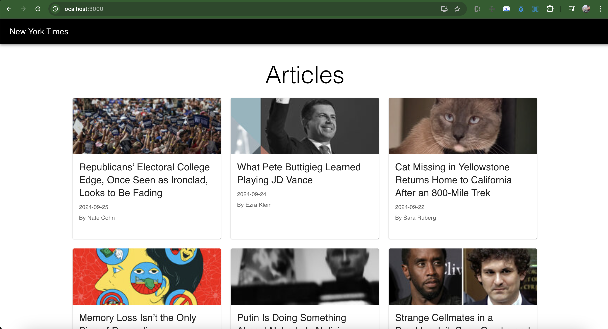
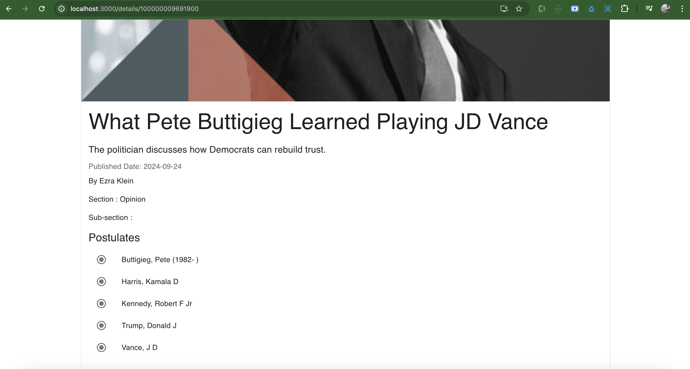
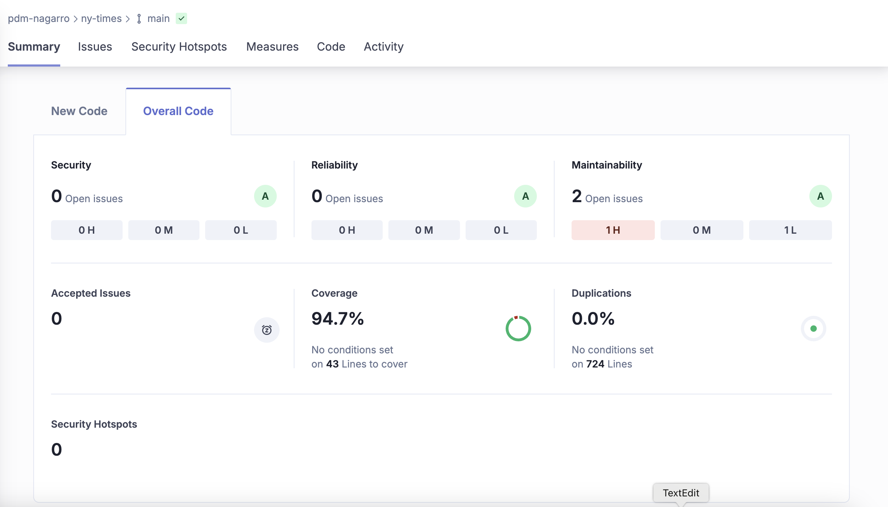

## NY Times

### Description

This project is a web application that fetches and displays articles from the New York Times Most Popular API. Users can view popular articles and see detailed information about each article.

The following routes/pages are included in this application:

**Articles Listing Page** - This page will retrieve the most popular articles from the New York Times API and display them using a grid layout.
Description Page - This page will show the details of the chosen article.

### Screenshot of the pages






### Installation

1. Clone the repository:
   ```
   git clone <repository-url>
   ```
2. Navigate to the project directory:
   ```
   cd ny-times
   ```
3. Install dependencies:
   ```
   npm install
   ```

### Usage

### To start the development server, run:

```
npm run start
```

This will start the application and open it in your default web browser.

### To build the project
 - run :

```
npm run build
```

 - Verify the build:

After the build process is completed, you should see a build folder in your project directory. You can serve the production build locally using any static server, or upload it to your hosting platform.

### Technology stack

React v18.3
React Router v6
SWR
ESlint for linting
Prettier for code formatting
SonarQube for code anaylsis
Material UI v5
React testing library
Jest
Cypress

### Scripts

- `start`: Starts the development server.
- `build`: Builds the application for production.
- `test`: Runs tests using Jest.
- `eject`: Ejects the application from Create React App.
- `coverage`: Runs tests with coverage report.
- `lint:js`: Lints JavaScript and TypeScript files.
- `lint`: Runs JavaScript and TypeScript linting.
- `sonarqube`: Runs linting, tests with coverage, and sends results to SonarQube for analysis.
- `cypress`: Runs Cypress tests.


### Generate SonarQube Test Coverage Report

1. Run Jest Tests with Coverage

   npm run test -- --coverage

   or 

   npm run test & npm run coverage

2. Push your changes on the repo, once pushed there is a action created for running the sonar scanner,      which will scan the code and generate the sonar report for us.

3. Verify Results in SonarQube Dashboard

Once the analysis completes:

- Visit your SonarQube Dashboard to view the results.
- You should see code coverage percentages under the "Coverage" section.
- Test execution and other test-related metrics will be displayed on the dashboard as well.
   

### Sonar Report




